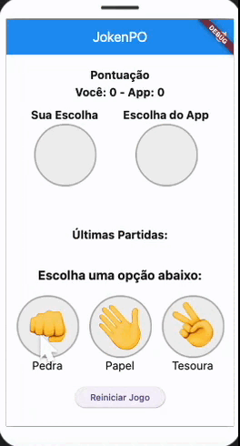

# JokenPO - Jogo de Pedra, Papel e Tesoura

## Descrição
JokenPO é um aplicativo mobile desenvolvido em Flutter que permite aos usuários jogarem o tradicional jogo de Pedra, Papel e Tesoura contra o próprio aplicativo. O jogo inclui animações, histórico das partidas e alteração de cores conforme o resultado.

## Tecnologias Utilizadas
- **Flutter** - Framework para desenvolvimento mobile
- **Dart** - Linguagem de programação
- **Material Design** - Interface moderna e responsiva

## Funcionalidades
- Jogue Pedra, Papel e Tesoura contra o app.
- Interface animada para a escolha do aplicativo.
- Sistema de pontuação.
- Histórico das últimas partidas.
- Possibilidade de reiniciar o jogo a qualquer momento.

## Instalação e Execução
1. Certifique-se de ter o Flutter instalado ([Guia de Instalação](https://flutter.dev/docs/get-started/install)).
2. Clone este repositório:
   ```sh
   [git clone https://github.com/Aghelena/jokenpo/tree/main]
   ```
3. Acesse o diretório do projeto:
   ```sh
   cd jokenpo-flutter
   ```
4. Execute o comando para instalar as dependências:
   ```sh
   flutter pub get
   ```
5. Execute o aplicativo:
   ```sh
   flutter run
   ```

## Estrutura do Projeto
```
/lib
  |-- main.dart          # Arquivo principal do aplicativo
  |-- jogo.dart          # Lógica principal do jogo
/assets/images/          # Imagens utilizadas no jogo
```

## Demonstração



